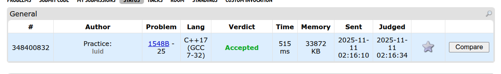

# Trabalho - Algoritmos Gulosos

**Número do trabalho:** 4  
**Conteúdo da Disciplina: Dividir e Conquistar**

## Alunos

| Matrícula |        Nome Completo       |
|:---------:|:-------------:|
| 221008285 | Luis Eduardo C M de Lima |
| 221007902 | Bruno Bragança dos Reis |

## Definição do trabalho

Para este trabalho a dupla optou por solucionar questões da plataforma **[CodeForces](https://codeforces.com/)**. Seguindo as orientações do professor Maurício Serrano, resolvemos 4 dsafios. Dois do nível difícil e dois do nível médio. Dessa maneira, a dupla busca demonstrar o conhecimento adquirido durante as aulas e estudos sobre o tema Algoritmos Gulosos.

Sobre a realização do trabalho, cada exercício contém seu código resposta, screenshots da tela de submissão do **[CodeForces](https://codeforces.com/)** e vídeo de até 5 minutos explicando objetivamente as resoluções porpostas.

## Linguagem utilizada
*´Cpp´ e ´C´*

## Screenshots

### Exercício 01 - Médio (Luis)
[Problem 1385D - a-Good String](https://codeforces.com/problemset/problem/1385/D)

### Exercício 02 - Difícil (Luis)
[Problem 1548B - Integers Have Friends](https://codeforces.com/problemset/problem/1548/B)

### Exercício 03 - Difícil (Bruno)
[Problem 559B - Equivalent Strings](https://codeforces.com/problemset/problem/559/B)

### Exercício 04 - Médio (Bruno)
[Problem 1490D - Permutation Transformation](https://codeforces.com/problemset/problem/1490/D)

## Vídeo de apresentação do Trabalho
[Vídeo](link)
